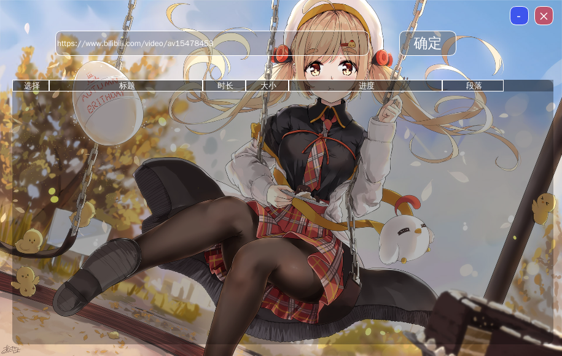

# bilibili-download
一个下载bilibili的视频的软件，用pyqt5结合多线程及线程池写的(只可以下载av的视频不能下载番剧，如要下载番剧请看我[另一个项目](https://github.com/Hellowshuo/bilibili-refactor))  
## 依赖
PyQt5  Python3  FFmpeg(用于分段视频合成及格式转换)
## 运行
`
python main.py 
`   

